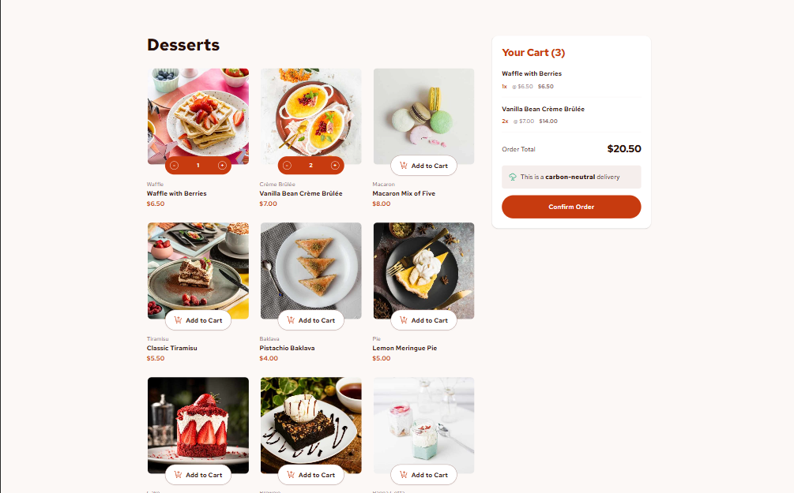

# Frontend Mentor - Product list with cart solution

This is a solution to the [Product list with cart challenge on Frontend Mentor](https://www.frontendmentor.io/challenges/product-list-with-cart-5MmqLVAp_d). Frontend Mentor challenges help you improve your coding skills by building realistic projects.

## Table of contents

- [Overview](#overview)
  - [The challenge](#the-challenge)
  - [Screenshot](#screenshot)
  - [Links](#links)
- [My process](#my-process)
  - [Built with](#built-with)
  - [What I learned](#what-i-learned)
  - [Continued development](#continued-development)
  - [Useful resources](#useful-resources)
  - [AI Collaboration](#ai-collaboration)
- [Author](#author)
- [Acknowledgments](#acknowledgments)

## Overview

### The challenge

Users should be able to:

- Add items to the cart and remove them
- Increase/decrease the number of items in the cart
- See an order confirmation modal when they click "Confirm Order"
- Reset their selections when they click "Start New Order"
- View the optimal layout for the interface depending on their device's screen size
- See hover and focus states for all interactive elements on the page

### Screenshot

### Links

- Solution URL: [Add solution URL here](https://www.frontendmentor.io/solutions/interactive-product-cart-with-vanilla-javascript-and-tailwind-css-3UNrcgWJ1w)
- Live Site URL: [Add live site URL here](https://vercel.com/robymarceddus-projects/product-list-with-cart)

## My process

### Built with

- Semantic HTML5 markup
- Flexbox
- CSS Grid
- Mobile-first workflow
- [Tailwind CSS](https://tailwindcss.com/) - Utility-first CSS framework
- JavaScript

### What I learned

I'm most proud of successfully integrating JavaScript logic into an existing HTML template and turning a static layout into an interactive application.

During this project I improved my understanding of DOM manipulation, state management, and working with JSON data. I also learned the importance of keeping application data separate from the UI and using JavaScript to dynamically update the interface.

Another aspect I'm proud of is the debugging process. I used browser DevTools, console logging, and Node.js validation tools to identify and fix issues related to rendering, event listeners, responsive layouts, and data loading.

If I were to start this project again, I would rely more on JSON-driven rendering from the beginning instead of manually building most of the HTML structure. This would make the application easier to maintain and scale while reducing duplicated markup.

### Continued development

I want to continue improving my confidence with JavaScript state management, DOM updates, responsive layout debugging, and accessibility for interactive controls.

### Useful resources

- [Tailwind CSS Documentation](https://tailwindcss.com/docs) - Used to work with responsive utility classes and layout styling.
- [MDN Web Docs](https://developer.mozilla.org/) - Used as a reference for JavaScript, DOM methods, and browser behavior.

### AI Collaboration

I used AI as a learning partner while debugging layout issues and JavaScript event handling. The AI helped me reason through why some controls worked only after certain interactions, how to inspect responsive layout problems, and how to structure a clearer debugging process.

## Author

- Frontend Mentor - [@RobyMarceddu](https://www.frontendmentor.io/profile/RobyMarceddu)

## Acknowledgments

Thanks to Frontend Mentor for the challenge and design assets.